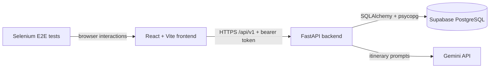

# Architecture

## System boundary

Wandora separates the browser client from the API and database. The frontend
does not connect to PostgreSQL or hold any Supabase credential.

## Repository boundaries

| Folder | Responsibility | Must not contain |
| --- | --- | --- |
| `src/backend/app/api` | HTTP routes and request dependencies | persistence logic or UI code |
| `src/backend/app/services` | business workflows | HTTP framework details |
| `src/backend/app/models` | SQLAlchemy persistence model | response serialization |
| `src/backend/app/schemas` | Pydantic API contracts | database access |
| `src/backend/migrations` | versioned Alembic schema migrations | feature business logic |
| `src/frontend/src` | React UI and browser-side state | database credentials |
| `tests/e2e` | black-box Selenium tests | direct database access |
| `scripts` | explicit operational/manual tasks | application runtime code |

## Backend request flow

1. A route in `src/backend/app/api/v1` validates input with a schema.
2. It receives a SQLAlchemy session through `get_db`.
3. A service coordinates the operation and uses models for persistence.
4. The route returns a schema-shaped response.

The database schema is created only through Alembic. The application startup
does not run DDL. This keeps local, CI, and Supabase schema state reproducible.

## Supabase model

Supabase is used as managed PostgreSQL, not as a browser-accessed database API.
The backend uses the connection URI in the root `.env`; the frontend does not
have access to it. The current database is at Alembic revision `f90ac4e2d112`.

Accounts are application-managed: FastAPI stores Argon2 password hashes in
`users`, issues signed JWT bearer sessions, and checks `workspace_members`
before returning or mutating a workspace. The frontend has no Supabase
credentials. For any future direct browser use of Supabase, add Supabase Auth
and Row Level Security before exposing a table.

## Current integration state

The frontend has a typed API client at `src/frontend/src/lib/api.ts`; it uses
`VITE_API_BASE_URL` and attaches the stored bearer token. Public routes are
`/` and `/auth` are public; `/home` is the authenticated **My trips**
dashboard. `/trips` remains a compatibility redirect to `/home`. Trip
creation and itinerary routes redirect to sign-in when there is no valid session.
